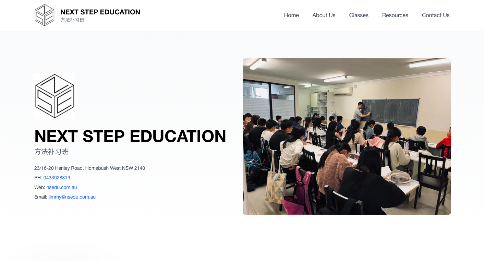
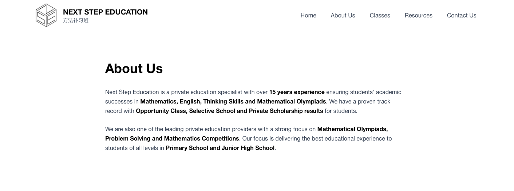
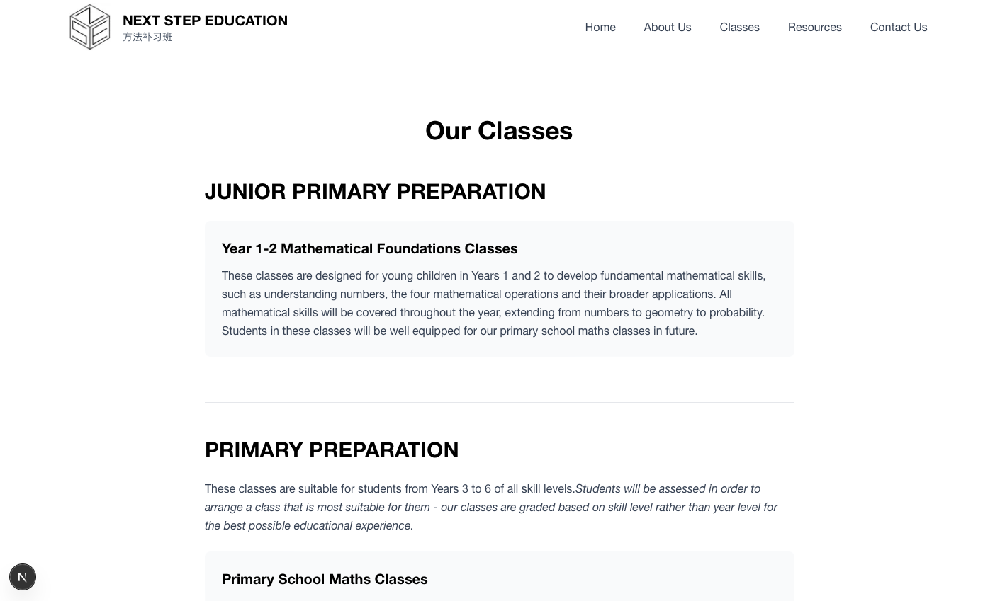
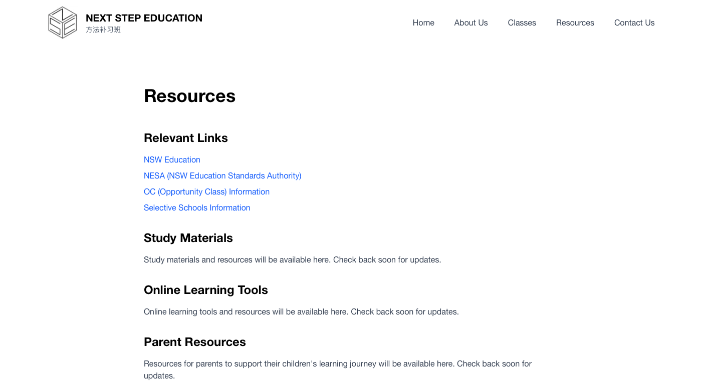
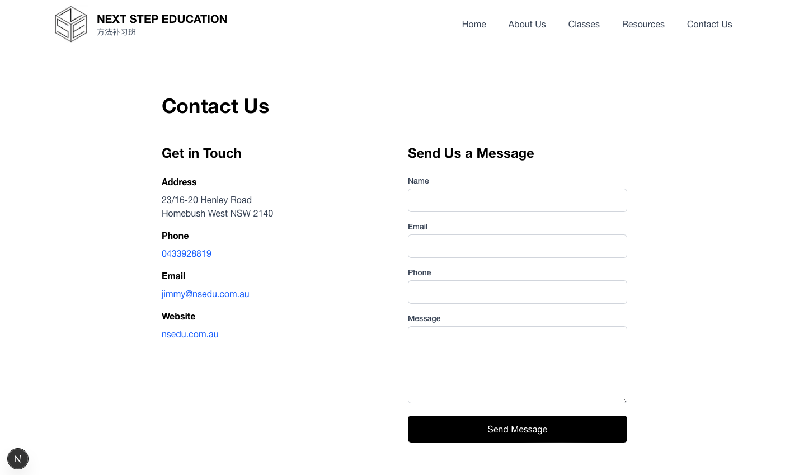

# Next Step Education (NS EDU) Website

**Version:** v1

Website for Next Step Education (方法补习班) - A private education specialist with over 15 years of experience in Mathematics, English, Thinking Skills, and Mathematical Olympiads.

**Website:** [nsedu.com.au](https://nsedu.com.au)

## About

Next Step Education is a private education specialist providing comprehensive tutoring services for students from Year 1 through Junior High School. We specialise in:

- Opportunity Class (OC) preparation
- Selective School preparation
- Private scholarship preparation
- Mathematical Olympiads and competitions
- Primary and Junior High School support

## Tech Stack

- **Framework:** Next.js 16 (App Router)
- **Language:** TypeScript
- **Styling:** Tailwind CSS v4
- **Font:** Helvetica Neue

## Screenshots (Version 1)

### Homepage


### About Us


### Classes


### Resources


### Contact Us



## Getting Started

### Prerequisites

- Node.js 18+ 
- npm, yarn, pnpm, or bun

### Installation

1. Clone the repository:
```bash
git clone https://github.com/yche9837/nsedu.git
cd nsedu
```

2. Install dependencies:
```bash
npm install
```

3. Run the development server:
```bash
npm run dev
```

4. Open [http://localhost:3000](http://localhost:3000) in your browser.

## Project Structure

```
app/
  ├── about/          # About Us page
  ├── classes/        # Classes information page
  ├── contact/        # Contact page with form
  ├── resources/      # Educational resources page
  ├── api/
  │   └── contact/    # Contact form API endpoint
  ├── layout.tsx      # Root layout with Navigation & Footer
  └── page.tsx        # Homepage

components/
  ├── Navigation.tsx  # Main navigation component
  └── Footer.tsx      # Footer component

public/
  └── images/        # Logo and homepage images
```

## Features

- **Homepage** with About Us, Classes overview, Resources, and Contact sections
- **About Us** page with company information
- **Classes** page detailing all 5 main class categories:
  - Junior Primary Preparation
  - Primary Preparation
  - OC Preparation
  - Selective + Scholarships Preparation
  - Junior High Preparation
- **Resources** page with educational links and study materials
- **Contact** page with functional contact form
- **Responsive design** optimized for all devices
- **Custom animations** and modern UI

## Available Scripts

- `npm run dev` - Start development server
- `npm run build` - Build for production
- `npm run start` - Start production server
- `npm run lint` - Run ESLint

## Future Versions

### Version 2 (Planned)

- **Login System** - User authentication for students, parents, and administrators
- **Student Information Management** - Database integration for student data
- **Student Dashboard** - Personalized dashboard for students and parents
- **User Roles** - Role-based access control (student, parent, admin)
- **Database Setup** - PostgreSQL or MongoDB integration

### Version 3 (Planned)

- **Assessment Portal (NSeDucate)** - Online assessment and testing platform
- **Enhanced Resources** - Resource library with access control
- **Student Progress Tracking** - Track student performance and progress
- **Assessment Management** - Create, manage, and grade assessments
- **Integration with V2** - Seamless integration with authentication system